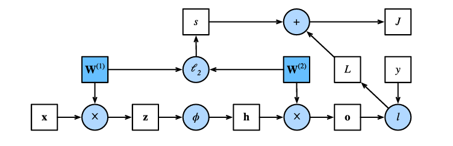

# Dive into Deep Learning

## Notes

- To Overcome the limitation of linear models we can incorporate one or more hidden layers
- A Linear model is just stacked up affine operations, and an affine after another is just another affine, which is not any solution for the problem of our model is only relying on Linear relations
- That’s where we introduce non-linear function (activations)

## Activation Functions

- They decide whether a neuron should be active or not by calculating the weighted sum and adding bias to it, They are differentiable  operators for transforming inputs signals into outputs, most of them adds non-linearity

ReLU Function

$ReLU(𝑥) = max(𝑥,0).$

- It only returns positive elements and discards all negative elements by setting their values into 0
- When the input is negative, the derivative of the ReLU function is 0, when the input is positive, the derivative  is 1, but the function is not differentiable if the input is precisely equal to 0, in this case we default to the left-hand side derivative and say it is 0
- The reason we use ReLU is that its derivatives are well behaves wither they vanish or they just let the argument go through. making optimization better behaved, helping the problem of vanishing gradients
- There is also many variants like Parameterized ReLU (pReLU)  that adds a linear term to ReLU so some information still gets through when when the arguments are negative
    - $pReLU(𝑥) = max(0,𝑥) + 𝛼min(0,𝑥).$

Sigmoid Function

$$
sigmoid(x) = \frac{1}{1 + e^{-x}}
$$

- The function transforms those inputs whose values lie in the domain ℝ, to outputs that lie on the interval (0, 1), that’s why it is often called a squashing function, it squashes any input in the range of (-inf, inf) into (0, 1) range.
- In the earliest neural network research, scientists was inspired by the bio neurons that either fire or don’t fire. So they focused on a thresholding activation that takes value 0 when the input is below some threshold and value 1 when it exceeds that threshold.
- We use the Sigmoid when we want to interpret the outputs as probabilities for binary classification problems
- You can think of sigmoid as a special case of Softmax, However it is been replaced by the simpler and more easily trainable ReLU for most use in hidden layers
- Sigmoid have challenges for optimization, since its gradient vanishes for large positive and negative arguments

$$
\frac{d}{dx} \sigma(x) = \frac{e^{-x}}{(1 + e^{-x})^2}
$$

This can also be written in terms of the sigmoid function itself:

$$
\frac{d}{dx} \sigma(x) = \sigma(x)(1 - \sigma(x))
$$

- The derivative of the sigmoid, when the input is 0 reaches a maximum , as the input diverges from 0 i either direction the derivative approaches 0

Tanh Function

$$
tanh(x) = \frac{e^x - e^{-x}}{e^x + e^{-x}}
$$

- Just like the sigmoid function the tanh also squashes its inputs transforming them into elements on the interval between -1 and 1
- when plotting the tanh function, as input nears 0, the tanh approaches a linear transformation
- The difference between it and sigmoid even they look similar when plotted, is that tanh exhibits point symmetry about the origin of the coordinates
- The derivative of the tanh, as input is near 0 the derivative approaches a maximum of 1, and as sigmoid when the input moves either direction the derivative approaches 0

## Implementing MLP

- It’s recommended to choose layer widths to be divisible by larger powers of 2, This is computationally efficient due to the way memory is allocated in hardware.
- To automatically register a class attribute as a parameter to be tracked by `autograd` we use `nn.Parameter`.

## Forward Propagation

- Refers to the calculation and storage of intermediate variables(including outputs) for a neural network in order from the input layer to the output layer

Computational Graph of Forward Propagation 

- Squares denote variables and circles denote operators
- Frobenius Norm of the matrix is simply L2 regularization applied to after flattening the matrix into a vector

## Backpropagation

- Refers to the method of calculating the gradient of the network parameters, Traversing from the output to the input (according to the chain rule from calculus)
- The Algorithm stores any intermediate variables (partial derivatives) required while calculating the gradient with respect to some parameters
- If we assumed we have Υ = ƒ(X) and Z = g(Y), By which inputs and outputs X, Y, Z are tensors of arbitrary shapes, by using the chain rule, we compute the derivative of Z with respect to X via:

$$
\frac{\partial Z}{\partial X}=\mathrm{prod}\left(\frac{\partial Z}{\partial Y},\frac{\partial Y}{\partial X}\right).
$$

- We use prod operator to multiply its argument after necessary operations like transposition and swapping input positions, For vectors it is matrix-matrix multiplication.
- Objective of the backpropagation is to calculate the gradients 𝜕𝐽/𝜕W(1) and 𝜕𝐽/𝜕W(2)
1. First step: calculate gradients of the objective function j =L + s with respect to the loss term L and regularization term s 

$$
\frac{\partial J}{\partial L}=1 \mathrm , {and} \frac{\partial J}{\partial s}=1.
$$

1. Second step: compute the gradient of the objective function with respect to variable of the output layer ο according to the chain rule:

$$
\frac{\partial J}{\partial\mathbf{o}}=\text{prod}\left(\frac{\partial J}{\partial L},\frac{\partial L}{\partial\mathbf{o}}\right)=\frac{\partial L}{\partial\mathbf{o}}\in\mathbb{R}^q.
$$

1. Third step: compute the gradients of the regularization term with respect to both parameters: 

$$
\frac{\partial s}{\partial\mathbf{W}^{(1)}}=\lambda\mathbf{W}^{(1)} \mathrm, {and} \frac{\partial s}{\partial\mathbf{W}^{(2)}}=\lambda\mathbf{W}^{(2)}.
$$

1. Forth step: calculate the gradient 𝜕𝐽/𝜕W(2) ∈R𝑞×ℎ of the model parameters closest to the output layer using chain rule: 

$$
\frac{\partial J}{\partial\mathbf{W}^{(2)}}=\mathrm{prod}\left(\frac{\partial J}{\partial\mathbf{o}},\frac{\partial\mathbf{o}}{\partial\mathbf{W}^{(2)}}\right)+\mathrm{prod}\left(\frac{\partial J}{\partial s},\frac{\partial s}{\partial\mathbf{W}^{(2)}}\right)=\frac{\partial J}{\partial\mathbf{o}}\mathbf{h}^{\top}+\lambda\mathbf{W}^{(2)}.
$$

1. To obtain the gradient with respect to W(1) we need to continue backpropagation along the output layer to the hidden layer. The gradient with respect to the hidden layer output 𝜕𝐽/𝜕h ∈ Rℎ is given by: 

$$
\frac{\partial J}{\partial\mathbf{h}}=\mathrm{prod}\left(\frac{\partial J}{\partial\mathbf{o}},\frac{\partial\mathbf{o}}{\partial\mathbf{h}}\right)=\mathbf{W}^{(2)\top}\frac{\partial J}{\partial\mathbf{o}}.
$$

1. Since the activation function ∅ applies elementwise, calculating the gradient 𝜕𝐽/𝜕z∈Rℎ  of the intermediate variable z requires that we use the elementwise multiplication operator donated by {o}: 

$$
\frac{\partial J}{\partial\mathbf{z}}=\text{prod}\left(\frac{\partial J}{\partial\mathbf{h}},\frac{\partial\mathbf{h}}{\partial\mathbf{z}}\right)=\frac{\partial J}{\partial\mathbf{h}}\odot\phi' (\mathbf{z}) .
$$

1. Finally we obtain the gradient 𝜕𝐽/𝜕W(1) ∈Rℎ×d of the model parameters closest to the input layer, According to the chain rule: 

$$
\frac{\partial J}{\partial\mathbf{W}^{(1)}}=\mathrm{prod}\left(\frac{\partial J}{\partial\mathbf{z}},\frac{\partial\mathbf{z}}{\partial\mathbf{W}^{(1)}}\right)+\mathrm{prod}\left(\frac{\partial J}{\partial s},\frac{\partial s}{\partial\mathbf{W}^{(1)}}\right)=\frac{\partial J}{\partial\mathbf{z}}\mathbf{x}^{\top}+\lambda\mathbf{W}^{(1)}.
$$

## Training Neural Networks

- When training neural networks both forward and backpropagation depend on each other
    - Computing the regularization term (e1) during forward propagation depends on the current values of W1 and W2, They are provided by the optimization algorithm according to the backpropagation in the most recent iteration
    - Computing the gradient for the parameter (eq2) depends on the current value of the hidden layer output h, given by the forward propagation
- That’s why once the model parameters are initialized we alternate between forward and backpropagation, the backpropagation reuses the stored intermediate values from forward propagation to avoid duplicate calculations
- One of the reasons training eats up so much memory than simple prediction is that we need to retain intermediate values until backpropagation is complete.

## Numerical Stability and Initialization

- The risks possessed by the unstable gradients go beyond numerical representation.. Gradients of unpredictable magnitude threaten the stability of our optimization algorithms, facing parameter updates that either very huge (exploding) or too small (vanishing)
- One frequent cause of vanishing gradient problem is the choice of the activation function 𝜎 that follows each linear layer operations.
    - The Sigmoid function was used in the past due to the threshold principle that is inspired from bio neurons
        
        
        
    - As we can see, Sigmond’s gradient vanishes both when its inputs are large and when they are small (when backpropagating through many layers)
    - That’s why we see ReLU have emerged as a default choice in practice
- The problem of Weight Symmetry happens when multiple neurons in a layer initialized in such a way that they become indistinguishable form each other, By using random initialization or techniques like dropout, we can break this symmetry and allow the network to utilize its full potential.

## Parameter Initialization

- Default Initialization: by using normal distribution to initialize the values of our weights. works well with moderate problem size.
- Xavier Initialization: maintains the variance of the output activations and gradients as close to  1 as possible throughout the network.

## Approaches for Understanding Generalization

- Remember that fitting the data is our intermediate goal, our goal is to discover general patterns.
- For short, Stochastic Gradient Descent has the ability to generalize remarkably well across myriad prediction problems. But if you have questions boggling in your mind about why the model generalize to unseen data; set down and pour a drink
- Generalization gap is the difference between our fit on the training data and our test data, when it is large we call it overfitting and vice versa
    
    
    
- There is an approach of looking to neural networks as non-parametric models, For example k-nearest neighbor algorithm, where the learner memorizes the dataset, Then at prediction it looks up for the nearest k that minimizes the distance, with any choice of the distance metric we will achieve zero training error eventually reaching optimal predictor
    - In a sense because NNs are over-parametrized, they tend to fit the data perfectly, thus behave more like a nonparametric models
    - Some Theoretical research have noticed a connection between large NNs and notably kernel methods, as a multilayer perceptron with randomly initialized weights grow infinitely wide, they become equivalent to kernel methods (neural tangent kernel)
- While deep neural networks are capable of fitting arbitrary labels, even when labels are randomized or assigned incorrectly
    - A new work in 2017 has revealed that in the setting of label noise, neural    networks tends to fit cleanly labeled data at first then the mislabeled data, this phenomenon translates directly into a guarantee on generalization: whenever a model has fitted the cleanly labeled data but not randomly labeled data, it has in fact generalized.
    - These findings help motivate early stopping , rather than directly constraining the values of the weights, we constrain number of epochs
    - Using a stopping criteria like monitoring validation error throughout training, then cutting off the training when the validation error has not decreased by more than a small amount ∈ for some number of epochs, this is called patience criterion
    - Note: training models until they interpolate noisy data is typically a bad idea.
- Weight decay is adding a regularization term to the loss function in order to penalize large values of the weights (L2 or L1)
    - These methods are still a popular tool, however typical strengths of L2 are insufficient to prevent the network from interpolating the data, So regularization only makes sense when combined with early stopping

## Dropout

- What do we expect from a predictive model? we want it to Generalize on unseen data.
- Classical Generalization Theory suggests that to close the gap between train and test performance, we should aim for a simple model, or with smoothness i.e., that the function shouldn’t be sensitive to small changes to its inputs For instance when we classify images we would expect that adding some random noise to the pixels should be mostly harmless
- Dropout involves injecting noise while computing each internal layer during forward propagation, this happens by dropping out some neurons during training (zeroing out some fraction of the nodes in each layer before calculating the subsequent one)
- The authors argued that neural network overfitting is characterized by a state in which each layer relies on a specific pattern of activations in the previous layer (co-adaptation).
- The challenge is how to inject this noise. One idea is to inject in an unbiased manner so the expected value of each layer equals the value it would have taken absent noise, In Bishop’s work he has added Gaussian Noise to the inputs to a linear model, At each iteration he added noise sampled from a distribution with mean zero to the input x
- In standard dropout regularization, we zero out some nodes in each layer then debiases each layer by normalizing it by a fraction of nodes that were retained (not dropped out), In other word, with dropout probability p each intermediate activation h is replaced by a random variable ĥ as follows
    
    
    

$$
h'=\begin{cases}0&\text{with probability} {p}\\\frac{h}{1-p}&\text{otherwise}\end{cases}
$$

## Convolutional Neural Networks

- Convolutional layers are a misnomer, since operations they express are more accurately described as cross-correlations
- An input tensor and kernel tensor are combined to produce an output tensor through cross-correlation operation.

- A convolutional layer cross-correlates the input and kernel and adds a scalar bias to produce an output, It’s two parameters are the kernel and the scalar bias
- Detecting Object’s Edge by finding location of pixel changes
- Only Designing an edge detector useful if we know what we are looking for, However with large kernels, it might be impossible to manually specify kernel values
- The convolutional layer output is called feature map, which is the learned representations in the spatial dimensions (width, height) to the subsequent layer, Receptive Field refers to all the elements from the previous layers that may affect the calculations of x during the forward propagation. It may be bigger than the actual size of the input.
- For the figure example, the receptive field is the shaded output (19) is the four elements in the shaded input (0, 1, 3, 4) we donate that the output (2 × 2) is  Y and consider a deeper CNN with additional 2 x 2 conv layer that takes Y as its input, outputting ʑ, so the receptive field on ʐ on Y includes all the four elements of Y
- When using conv layers we tend to lose pixels on the perimeter of out image, the larger the kernel size we use the more pixels around the corners we get to hardly use at all, and with deeper networks this number increases
    - By adding some filler pixels  around the input image’s boundary
        
        
        
    - CNNs usually uses kernels with odd height and width values, 1, 3, 5 or 7. which has the benefit that we can preserve the dimensionality while padding with the same number of rows on top and bottom and the same number of columns on left and right.
    - By setting different padding numbers for height and width we can make the output and input have the same height and width
- We start the cross-correlation operation we set the window on the top left corner then slide it over all locations both down and to the right, If your convolutional kernel is large, it might be useful to skip some intermediate locations by moving the window more than one element at a time, We refer to a number of rows and columns traversed per slide  as stride.
    
    
    
- For Conv layers with more than 1 color channels we need a kernel with the same input shape by which for each input channel, Then Concatenating the results of each kernel’s output summing over the channels to yield a two-dimensional tensor.
    
    
    
- Regardless of number of input channels, we ended up with one output, However in real life the deeper the network the more channel dimensions we increase (Down sampling to trade off spatial resolution for greater channel depth)
    - As we go deeper the spatial dimensions of the feature maps decrease due to convolution and pooling operations. This means that we loose the detail about the exact position of features but focus more on the presence of them.
    - As we go deeper channels no longer just corresponds to simple colors. Instead, they represent different learned feature maps
    - You could think of each channel responding to a different set of features (reality is more complicated)
    - A naive interpretation would suggest that representations are learned independently per pixel or per channel, But in reality channels are optimized to be jointly useful. This means that rather than mapping single channel to an edge detector, It means some direction in channel space corresponds to detecting edges.
    - As we go deeper Features become abstracted. In early layers, features are low level like edges and textures, In deeper layers they become high level like specific objects or parts of objects
    - To get an output with multiple channels we create a kernel tensor for every output channel we want, then concatenate them on the output channel dimension
- There is a 1 x 1 Conv layer sometimes used in the complex deep networks, Because of the tiny window size being used it loses the ability to capture patterns that consists of interactions among adjacent elements in the height and width dimensions, So the only computation it is used for is on the channel dimensions
    
    
    
    - You could think of it as a fully connected layer applied at every single pixel location to transform the input to output values
    - It performs a weighted sum of the input channels at each spatial location. Allowing the network to combine information from different channels
    - Although it is a linear operation, it is usually followed by a non-linear activation functions like ReLU
- Reducing spatial resolution accelerate the process of increasing the sensitivity of the final layers towards changes in the input layer By gradually aggregating information
- Moreover when detecting lower-level features, such as edges we need out representations to be immune to translation, For instance with small changes to pixels edges may shift due to vibration of the camera.
    - We use pooling layers for gating the sensitivity of convolutional layers to location and spatial representations
    - It works just like Conv layers with fixed-shape window that is slid over all regions in the input according to a stride, But it differ in that it doesn’t have a kernel with values, rather a deterministic approach of either calculating the maximum or the average value of the elements in the pooling window.
    - By using 2 x 2 max-pooling layer after a conv layer we can detect if the pattern recognized by the conv layer moves no more than one element in height or width, that’s one of the reason it is preferred from average pooling ( it has some degree of invariance to the output )
    - Like conv layers pooling change the output shape, so to achieve desired output shape we can adjust the operation by padding the input and adjusting the stride
    - When processing multi-channel input data, the pooling layer pools each input separately, rather than summing the inputs up over channels as in convolutional layer, Meaning that the number of the output channels equal to the input ones.

LeNet:

- Basic units in each Convolutional block are Conv layer, sigmoid activation and a subsequent average pooling operation (ReLU and max-pooling haven’t been discovered yet)
- Each Conv layer have a 5 x 5 kernel and a sigmoid activation function, mapping spatially arranged inputs to a number of two-dimensional feature maps, increasing number of channels
    - First Conv layer has 6 output channels, Second has 16, Each 2 x 2 pooling operation (2 stride) reducing dimensionality by a factor of 4 (spatial downsampling)
    - The Convolutional block emits output of shape (batch size, number of channel, height, width).
- To pass the Conv’s Block output to Dense block we need to flatten each example in the mini-batch, In other words, We take the four-dimensional input and transform it into the two-dimensional input expected by the Fully Connected Layers (first dimension indexes the examples in the minibatch, second gives the flat vector representation of each)
    - The Dense block have three fully connected layers with 120, 84, 10 outputs (for digit recognizer)

## Modern Convolutional Neural Networks

- Between 1990s and 2012, with the success of LeNet, such machine learning models such as kernel methods, ensemble models and structures estimation was surpassing it.

### AlexNet

- AlexNet used ReLU rather than the sigmoid activation function, because if the model parameters are not properly initialized the sigmoid function may obtain a gradient of almost 0 in the positive interval
- It controls the complexity of the fully connected layers by Dropout, while LeNet only used weight decay.
- The training loop also added image augmentation like flipping, clipping and color change
- AlexNet has its Achilles heel when it comes to efficiency: the last two hidden layers requires large size matrices, corresponding to large memory usage and  MFLOPS of computation, This is one of the reasons we don’t use it on mobile devices
- Due to improved regularization like Dropout, while the network has so much parameters (the last two layers exceed 40 million parameters) there is hardly any overfitting.

### Networks Using Blocks (VGG)

- Researchers moved on from thinking about individual neurons into thinking about whole layers, then Blocks
- The idea of using blocks emerged from the Visual Geometry Group at Oxford
- The basic block of CNNs is a sequence of a convolutional layer with padding to maintain resolution, Nonlinearity such as ReLU and a Pooling layer to reduce resolution
    - The problem of this approach that the spatial resolution decreases quite rapidly, For instance in case of ImageNet it would be impossible to have more than 8 convolutional layers in this way
    - The key idea here is that the Paper’s researchers was to use multiple convolutions in between downsampling via max-pooling in a form of a block, (they were interested in whether wider or deeper networks perform better), For example using two 3 x 3 conv touching the same pixels as a single 5 x 5 conv does, Where the latter uses as many parameters as three 3 x 3 convs do; They showed that deep and narrow networks outperforms their shallow ones, This has led stacking 3 x 3 convs becoming a gold standard in later deep networks
    - Single VGG block consists of a sequence of Convolutions with 3 x 3 kernels with padding of 1 followed by a 2 x 2 max-pooling layer with a stride of 2
    - Like AlexNet and LeNet, the network can be divided into convolutional with pooling and fully connected layers. The difference is that the convolutional layers are grouped in nonlinear transformations that leave the dimensionality unchanged (Conv Layers), followed by a resolution reduction step (Max-pool)
    - The grouping of convolutions as a pattern has remained unchanged over the past decade with the variable `arch` consists of a list of tuples (one per block) where each contains the number of convolutions and the number of output channels
    - The original VGG had 5 conv blocks, the first two have one conv layers each, latter three each have two conv layers each. The first block has 64 output channels then each subsequent block doubles the number of output channels until that number reaches 512
    - 

### Network in Network (NiN)

- All the last architectures share a common design pattern of extracting features via a sequence of convolutions and pooling layers then process the representations via fully connected layers
    - But the design flow is that the final fully connected layers are so much memory insufficient with a huge number of parameters.
- The NiN blocks offers a solution by using a 1 x 1 convolutions to add local nonlinearity across the channel activations then uses global average pooling to integrate all locations in the last representation layer.
- The idea behind NiN is to apply a fully connected layer at each pixel location (for each height and width), the resulting 1 x 1 convolution can be thought of as a fully connected layer acting independently on each pixel location
    
    
    
- NiN has dramatically fewer parameters than AlexNet and VGG, this is because of replacement of fully connected layers with  Global Average Pooling to aggregate across all image locations after the last stage of the network body, with no harm of accuracy
- 

### Multi-Branch Networks (GoogleNet)

- Using a structure that combines the strengths of NiN, repeated blocks and a cocktail of convolutional kernels
- The key contribution in GoogleNet was the design of the network body, which solved the problem of selecting convolution kernels in a genius way
- The basic convolutional block in GoogleNet is called Inception Block (from the meme ‘we need to go deeper’ from the movie Inception)
    
    
    
- The inception block consists of four parallel branches, the first three branches use convolutional layers with window size of 1 x 1, 3 x 3 and 5 x 5 to extract information from different spatial sizes. The middle two branches also add a 1 x 1 convolution of the input to reduce the number of channels  (reducing the model’s complexity). The forth branch uses a 3 x 3 max-pooling layer followed by a 1 x 1 convolutional layer to change the number of channels
- The four branches all use appropriate padding to give the input and output the same width and height. Then the output of each branch is concatenated along the channel dimension.
- The Architecture itself consists of a total of 9 inception blocks, arranged into three groups with max-pooling in between, and a global average pooling in its head to generate the estimations
    - Max-pooling between blocks reduces the dimensionality.
    - The First module is similar to AlexNet and LeNet. With a Convolutional layer then a ReLU then a Max-pooling
    - The Second module uses two conv layers (64, 1x1) (192, 3x3), then Max-Pooling
    - The Third module connects two complete Inception blocks in series, The first one’s channels output is 64+128+32+32 = 256, corresponding to Branches ratios 2 : 4 : 1 : 1. The second block’s channel output is increased to 128 + 192 + 96 + 64 = 480 with a ration of 4 : 6 : 3 : 2
    - The Forth model connects five inception blocks in series, and they have 192+208+48+64 = 512, 160+224+64+64=512,128+256+64+64 = 512, 112+288+64+64 = 528,and256+320+128+128 = 832 output channels
    - The Fifth Module has two inception blocks with 256+320+128+128 = 832and384+384+
    128+128 = 1024 output channels. This block uses the global average pooling layer to change height and width of each channel to 1 (like in NiN) then we turn the output into a two-dimensional array followed by a connected layer whose number of outputs is the number of label classes
    
    
    
- GoogleNet is computationally complex, we can see that with the ton of hyperparameters we need to specify manually.

### Batch Normalization

- This is an popular and effective technique that accelerate the convergence of deep networks, together with residual blocks, training networks with over 100 layers became possible.
- Normally we do some data preprocessing before training, like normalization and standardization helping the data be more controlled, also they help constraining the complexity of functions that other functions rely on.
- For a Typical MLP or CNN as we train, the variables in the intermediate layers may take values that has widely varying magnitudes. The Inventors of batch normalization proposed that this drift in the distribution of such variables could hamper the convergence of the network. Also, if we have one layer that has variables that are 100 times that of an another one, this will need some learning rate adjustment ( Adaptive solvers such as AdaGrad, Adam, Yogi or Distributed Shampoo aims to address this problem from a view of optimization ). The Alternative is to prevent the problem from occurring by Adaptive Normalization.
- It is obvious that deep networks are complex and tend to more liable to overfit, this means that regularization became more critical
- A common technique for regularization is noise injection. either for the inputs or intermediate values, it also forms the basis of Dropout.
- Batch Normalization is applied to individual layers or even to all of them. In each iteration we firstly normalize the inputs (of batch normalization) by subtracting their mean and dividing by their standard deviation (both are estimated based on the statistics of the current minibatch) Next we apply a scale coefficient and an offset to recover the lost degrees of freedom (this is why we rely on batch statistics)
    - By Standardizing each feature to have a mean of 0 and variance of 1 we constrain the representation (lost flexibility / degree of freedom) in how the model can represent data
    - If we applied Batch Normalization with minibatches of size 1 we wouldn't be able to learn anything. This is because after subtracting the means, each hidden unit would take value 0. Only if we applied it to large enough minibatches it proves its effectiveness and stability
        
        $$
        \mathrm{BN}(\mathbf{x})=\boldsymbol{\gamma}\odot\frac{\mathbf{x}-\hat{\boldsymbol{\mu}}_{\mathcal{B}}}{\hat{\boldsymbol{\sigma}}_{\mathcal{B}}}+\boldsymbol{\beta}.
        $$
        
    - We recover this degree of freedom by including an elementwise scale parameter 𝜸 and shift parameter 𝜷, that have the same shape as  x, Both are learned parameters during training.
    - The Variables magnitudes for intermediate layers cannot diverge during training because of BN that actively centers and rescales them back to a given mean and size
        
        $$
        \hat{\boldsymbol{\mu}}_{\mathcal{B}}=\frac{1}{|\mathcal{B}|}\sum_{\mathbf{x}\in\mathcal{B}}\mathbf{x} \mathrm{and} \hat{\boldsymbol{\sigma}}_{\mathcal{B}}^{2}=\frac{1}{|\mathcal{B}|}\sum_{\mathbf{x}\in\mathcal{B}}(\mathbf{x}-\hat{\boldsymbol{\mu}}_{\mathcal{B}})^{2}+\epsilon.
        $$
        
    - We add a small constant 𝜖 > 0 to the variance to ensure that we never attempt to divide by zero
    - Even in cases where variance might be very small or vanish, the estimate mean and variance fix the scaling issue by using noisy estimates of them. For reason we don’t know yet, sources of noise in optimization often lead to faster training and less overfitting. (acts like a form of regularization)
    - BN works best around 50 - 100 sized minibatch (injecting the right amount of noise per layer)
    - BN layers function differently in training mode (normalization by mini-batch) than in prediction mode (normalized by dataset statistics). resembling the behavior of dropout regularization where noise is only injected during training.
- While other layers perform their operations independently for each sample. BN needs all samples in the batch to compute the necessary statistics for normalization.
    - When applying batch normalization to fully connected layers, some researchers inserted BN after the affine operation and before the activation function, Others applied it after the activation .
    
    $$
    \mathbf{h}=\phi(\mathrm{BN}(\mathbf{Wx}+\mathbf{b})).
    $$
    
    - Similarly with convolutional layers, we can apply BN after conv but before activation. The key difference here that we apply the operation on a per-channel basis across all locations (this is similar to the idea of translation invariance that led to convolutions when we assumed that the specific location of a pattern within an image isn’t critical)
        - We collect all the values over all spatial locations when computing the mean and variance then apply the same mean and variance within a given channel to normalize the value at each spatial location. Each Channel has its own scale and shift parameters (both are scalars)
- In the context of Convolutions BN can work well even with mini-batches of size 1 (we have all locations across an image to average.)
- Batch Normalization after training (for prediction) uses the entire dataset to compute stable estimates of the variable statistics, then fix them at prediction time
- Layer Normalization works like BN only that it is applied to one observation at a time. It doesn’t rely on the batch size (useful when you can’t use large batches or for sequence models like RNNs). For each individual data sample it computes mean and variance for all the features in that layer, then uses this statistics to scale and shift the data so the features have a mean of 0 and a variance of 1
    - LN also is a deterministic transformation independent of whether we are in training or test regimes. It just standardizes the activations to a given scale.
- 

### Residual Networks (ResNet) and ResNeXt

- Regularization control complexity and achieve consistency
- A class of a functions by which a specific network architecture with learning rate and other hyperparameters can be reached

- Thus only if larger function classes contain the smaller ones we are guaranteed that increasing them increases the expressive power of the network

- With Residual blocks, inputs can forward propagate faster through the residual connections across layers. It could be think of as a special case of multi-branch Inception Block, Having two branches one of them is the identity mapping.
- ResNet has VGG’s full 3 x 3 conv layer design, the residual block has two 3 x 3 conv layers with the same number of output channels, Each conv layer is followed by a batch normalization layer and a ReLU. Then, we skip these two conv operations and add the input directly before the final ReLU activation (requiring that the output of the two conv layers has to be the same shape as the input, so that they can be added together.
- if we want to change the number of channels we need to introduce an additional 1 x 1 conv layer, to transform the input into the desired shape for addition operation, In the beginning of each ResNet block we use it to reduce spatial dimensionality by increasing the stride.

- The first two layers of ResNet architecture is the same as those of the GoogLeNet, with the 7 x 7 conv layer with the 64 output channels and a stride of 2. The difference is the batch normalization layer added after each conv layer in ResNet.
- GoogleNet uses 4 modules made up of Inception Blocks, In ResNet we have 4 modules made up of residual blocks, each uses several residual blocks with the same number of output channels (number of channels in the first module is the same as the number of input channels.
- We use a max-pooling layer of stride 2 so it is not necessary to reduce the height and width.
- In The first residual block for each of the subsequent modules, the number of channels is doubled compared with that of the previous module (width and height is halved)
- Two residual blocks are used for each module Just like GoogleNet we add a global pooling layer followed by a FCL output

- The resolution decreases while number of channels increases up until the point where a global average pooling layer aggregates all features.
- One of the challenges in the design of ResNet is the trade-off between non-linearity and dimensionality within a given block. That is we can add more nonlinearity by increasing the number of layers, or by increasing the width of the conv layers or increase the number of channels that can carry information between blocks (comes with a huge cost of computation).
- By taking inspiration from Inception Blocks which has information flowing through the block in separate groups. Applying the idea of multiple independent groups to ResNet we get the design of ResNext
- ResNext adopts the idea of transformation in all branches, thus minimizing the need for manual tuning of each branch

- Grouped Convolutions by is breaking up a convolution from ci to co channels into groups of size ci/g, generating g outputs of size co/g.
- No information is exchanged between the g groups. The ResNext block solves this in two ways: the grouped convolution with a 3 x 3 kernel sandwiched in between two 1 x 1 convolutions (changing number of channels back). The residual connection is replaced by a 1 x 1 convolution.
- The idea of grouped convolutions dates back to AlexNet when distributing the network across two GPUs with limited memory treating each GPU as its own Channel
- Nested function classes allow us to obtain more powerful rather than different function classes when adding capacity. One way this happens by letting some layers pass input through others
- Residual Mapping can learn identity function more easily, (pushing parameters in the weight layer to zero)
- ResNet and ResNext solves the obstacle for the designer to manually reach the optimal hyperparameters

### Densely Connected Networks (DenseNet)

- DenseNet combines the logic of connecting each layer with all the preceding layers and also the concatenation rather than addition in ResNet to preserve and reuse features from earlier layers.
    
    
    
- ResNet decomposes a function into a simple linear term and a more complex nonlinear one, What if we wanted to capture information beyond two terms?
    
    
    
- The key difference here is the concatenation process rather than addition as a result performing a mapping from x to its values after applying complex sequence of functions

$$
 x →[x, 𝑓1(x), 𝑓2 ([x, 𝑓1 (x)]) , 𝑓3 ([x, 𝑓1 (x) , 𝑓2 ([x, 𝑓1 (x)])]) ,. . .] .
$$

- In the end all these functions are combined in MLP to reduce the number of features
- Main components here are dense blocks which define how the inputs and outputs are concatenated. And transition layers which control the number of channels so that it is not too large since the expansion of x can be quite high-dimensional
- DenseNet uses the modified “Batch Normalization, Activation and Convolution” structure of ResNet.
- A Dense Block consists of multiple convolution blocks, each using the same number of output channels. In Forward propagation we concatenate the input and output of each convolution block on the channel dimension.
- Number of convolution block channels controls the growth in the number of output channels relative to the number of input channels referred to as the growth rate.
- Since each dense block will increase the number of channels, adding too many will lead to an excessive complex model. Transition layer is used to control that complexity by reducing the number of channels by using 1 x 1 convolution also it halves the height and width via average pooling with a stride of 2

### Designing Convolutional Network Architectures

- After AlexNet it has become popular to construct very deep networks by stacking blocks of convolutions specially the 3 x 3 convolutions popularized by VGG. Also the 1 x 1 presented by NiN to add local nonlinearity
- NiN solved the problem of aggregating information at the head of a network by aggregating across all location
- GoogleNet added multiple branches of different convolution width, combining the advantages of VGG and NiN in its Inception Blocks
- ResNet Allowed very deep networks
- ResNext added grouped convolutions offering a better trade-off between parameters and computation.
- The Squeeze-and-Excitation Networks (SENets) allowed for efficient information transfer between locations. (accomplished by computing a per-channels global attention function)
- We didn’t cover up neural architecture search (NAS) because they have enormous cost of computation. They rely on brute-force search, genetic algorithms, reinforcement learning, and other hyperparameters optimization. To select an architecture based on the returned performance estimation, producing a single network instance. (EffienctNets)
- We will see the world of Design Network Design Spaces, A strategy combining the strengths of manual design and NAS. Accomplishing this by operating on different distributions of networks and optimizing these distributions in a way to obtain good performance
    - The outcomes are RegNets, RegNetX and RegNetY.
- The AnyNet Design Space: a Template for designing CNNs:
    - The Stem: performing initial image processing (often convolutions with a large window)
    - The Body: consists of multiple blocks each with multiple stages, performing the bulk if transformations needed to go from raw images to object representations
        - Each Stage performs operations on decreasing image resolutions.
        - Each stage consists of one or more blocks
    - The Head: converts these representations into desired output, either for multi-class classification (via softmax regressor).
    
    
    
- The AnyNet stem takes as its input RGB images (3 channels) using a 3 x 3 convolutions with a stride of 2, followed by a batch normalization, to halve the resolution.
- AnyNet was designed to work with ImageNet images of shape 224 x 224 x 3, the body reduces these into 7 x 7 x C3 through 4 stages ( 224 / 2^1+4 = 7) each with a stride of 3. The Head serves a standard design of average global pooling then a fully connected layers to emit an n-dimensional vector for n-class classification
- In total we have 17 parameters for the generic design space, this is unreasonably large number of configurations that would warrant exploding. (we have to explore 2^17 = 131072 combinations)
- We have 4 simple rules to follow:
    1. We assume that already existing design principles exists, we can take them as guide lines.
    2. We don’t need to train a network until convergence to evaluate the performance, we could use intermediate results as reliable guidance for the final accuracy. Multi-Fidelity Optimization by few passes of our data through our model .
    3. Results obtained at a smaller scale generalize over larger ones, carrying out optimization from smaller network that have a similar architecture (a smaller number of blocks, fewer channels).
    4. Aspects of the design can be approximately factorized so that it is possible to infer their effect on the quality of the outcome independently
- SKIPED THE PART OF CDF .
- The resulting AnyNet design space consists of simple networks following these design principles:
    - Share the bottleneck ration ki = k for all stages i
    - Share the group width gi = g for all stages i
    - Increase network width across stages ci ≤ ci+1
    - Increase network depth across stages di ≤ di+1
- Observing these results we see that the width of the network ideally increases linearity with the block index across the network. Bottleneck ratio of 1 performs best (we advice not to use bottleneck at all

## Recurrent Neural Networks

- Each type of data we have handled until now is fixed-size (tabular) meaning it can be arranged in tables, each example has its own row and each attribute has its own column.
- In Chapter 7 we moved on to image data, where inputs consists of raw pixel values at each coordinate of an image, However we still have fixed-size data.
- The question here is What if we need to process sequence of images like videos or a Sequential structured prediction like in image captioning?
- Recurrent Neural Networks handles sequences of data with recurrent connections. Which can be thought of as cycles in the network of nodes, Not like of what we have delt with. RNNs are unrolled over time steps with the same parameters applied at each step.
    
    
    
- RNNs can be thought of as feedforward neural networks where each layer’s parameters (conventional and recurrent) are shared across each timestep.

### Handling Sequences

- A collection of documents, Long streams of sensor readings and Sequence representation of patient stays in the hospital. are all examples of Sequenced Data.
- When we handled normal data, we didn’t assume that each example depends on what position it is on. But when we deal with text data for example, the frequency of a certain word to appear depends on the subsequent words.
- Unsupervised Density Modeling (Sequence Modeling) where we are given a collection of sequences our goal is to estimate the probability mass function that tells us how likely we are to see any given sequence.
- Models that regress the value of a signal on the previous values of the same signal are naturally called autoregressive models. The number of inputs increases with the amount of data we encounter. Thus when treating historical data as training set, we get treat each example has a different number of features.
- To overcome this we might think of a moving-window approach. Because sometimes we don’t need to look so much on the past. Secondly, we might develop some summary ℎ𝑡  of the past observations. with this we don’t only have outputs we have summaries that we need to update each step. these models are called ***latent autoregressive models.***
    
    
    
- When working with languages, we wish to estimate the probability of an entire sequence (sequences that are composed of discrete tokens such as words) these are called Language Models.
    - If we are working with discrete signals like words, then the autoregressive model must be a probabilistic classifier, outputting a full probability distribution over the vocabulary for whatever word sill come next given past context.
    - Whenever we can throw away the history beyond t steps without any loss in the prediction power, we say that the sequence satisfies a Markov Condition (that the future is conditionally independent of the past, given recent history).  When t = 1 we say the data is characterized by a First-order Markov Model where the factorization of out joint probability becomes a product of probabilities of each word given the previous word.
- True Markov Model simply counts the number of times that each word has occurred in each context, producing the relative frequency estimate of  𝑃(𝑥𝑡 | 𝑥𝑡−1).
- When predicting so much into future we see that simple Linear Autoregression model fails, this is because error builds up so much (Like predicting weather for the next 24 hours is accurate but further we fail)
    
    
    

### Text into Sequences

- Tokens are the atomic indivisible units of text. Each time step corresponds to 1 token
- We have seen how to map words into tokens.
- Joint Probability using Chain Rule helps us compute the probability of entire sequence by looking at the probability of each word (or token) in the sequence conditioned on the previous words.
- Using the chain rule, this is expanded as:
    
    $P(deep, learning, is, fun)=P(deep)⋅P(learning∣deep)⋅P(is∣deep, learning)⋅P(fun∣deep, learning, is)P(\text{deep, learning, is, fun}) = P(\text{deep}) \cdot P(\text{learning} | \text{deep}) \cdot P(\text{is} | \text{deep, learning}) \cdot P(\text{fun} | \text{deep, learning, is})$
    

$P(deep, learning, is, fun)=P(deep)⋅P(learning∣deep)⋅P(is∣deep, learning)⋅P(fun∣deep, learning, is)$

1. **$P(deep)P(\text{deep})P(deep)$**: The probability that "deep" is the first word.
2. **$P(learning∣deep)$$P(\text{learning} | \text{deep})P(learning∣deep)$**: The probability that "learning" comes after "deep."
3. **$P(is∣deep, learning)P(\text{is} | \text{deep, learning})P(is∣deep, learning$)**: The probability that "is" comes after "deep" and "learning."
4. **$P(fun∣deep, learning, is)P(\text{fun} | \text{deep, learning, is})P(fun∣deep, learning, is)$**: The probability that "fun" comes after "deep, learning, is."
- Words frequency can be calculated by the probability of words can be calculated from relative word frequency of a given word in the training dataset. the estimate $ˆ𝑃(deep)$ can be calculated as the probability of any sentence starting
with the word “deep”. Another approach would be to count all occurrences of word “deep” and divide it by the total number of words in the corpus

$$
\hat{P}(\text{learning}\mid\text{deep})=\frac{n(\text{deep, learning})}{n(\text{deep})},
$$

- The more we want n-grams the more difficult it would be to compute the frequency of these combinations
- A common strategy is to perform Laplace smoothing. By adding a small constant to all counts

$$
\begin{gathered}\hat{P}(x) =\frac{n(x)+\epsilon_1/m}{n+\epsilon_1}, \\\hat{P}(x^{\prime}\mid x) =\frac{n(x,x^{\prime})+\epsilon_2\hat{P}(x^{\prime})}{n(x)+\epsilon_2}, \\\hat{P}(x''\mid x,x') =\frac{n(x,x^{\prime},x^{\prime\prime})+\epsilon_3\hat{P}(x^{\prime\prime})}{n(x,x^{\prime})+\epsilon_3}. \end{gathered}
$$

- Where epsilons are hyperparameters, n is the total number of words in the training set and m is the number of unique words. With epsilon 1 = 0 no smoothing is applied, when it approaches positive infinity, P(X) approaches the uniform probability 1/m.
- Entropy: measures the uncertainty or average information content in a distribution, Telling us how unpredictable or ‘random’ the sequence of tokens is. High random sequences would have high entropy because it is harder to predict the next token, A more predictable sequence would have low entropy because the next token can be guessed easily.
- Surprisal (self-information) :  measures how ‘surprising’ a particular outcome is given a probability distribution, If a token is very likely to occur, its surprisal is low. and vice versa.
- Cross-Entropy: is a way to measure the difference between the predicted probability distribution (from your model) and the actual distribution (the true labels).
- Perplexity: is the Geometric Mean (used for numbers that represent probability or rates) of the number of real choices that we have when deciding which token to pick next.
- Dataset have a form of a sequence of T token indices in corpus, we will partition it into subsequences, where each subsequence has n tokens (time steps). To iterate over all the tokens of the entire dataset for each epoch and obtain all possible length-n subsequences, we will introduce randomness.
- For our Language Model, the goal is to predict the next token based on the tokens we have seen so far, The targets are the original sequence, shifted by one token.
    
    
    

### Recurrent Neural Networks

- As we have seen in Markov Models and n-grams for language modeling, Where we rely on the conditional probability of token x at time step t only depends on the n-1 previous tokens. If we want to incorporate the possible effect of tokens earlier than time step t -(n-1) on x, we need to increase n. With that comes an exponentially increase of the model parameters as we need to store more numbers for vocabulary.
- That’s why it is preferable to use a latent variable model. Where ht-1 is a hidden state that stores the sequence information up to time step t-1. At any time step hidden state can be calculated based on both the current input xt and the previous hidden state ht-1

$$
P(x_t\mid x_{t-1},\ldots,x_1)\approx P(x_t\mid h_{t-1}),
$$

$$
 ℎ𝑡 = 𝑓(𝑥𝑡, ℎ𝑡−1).
$$

- For the function ƒ, the the latent variable model is not an approximation, ht may simply store all the data it has observed so far. However this will take so much computation and storage.
- Hidden states are just inputs to whatever we do at a given step, they only can be computed by looking at data at previous steps.
- With a MLP with a single hidden layer, It’s output H is :
    
    $$
    \mathbf{H}=\phi(\mathbf{X}\mathbf{W}_\mathrm{xh}+\mathbf{b}_\mathrm{h}).
    $$
    
- We have the Weight parameter and the Bias, we do broadcasting during the summation. Next the hidden layer output H is used as input of the output layer, If it is a classification problem we use softmax (O) to compute the probability distribution of the output categories. We pick feature-label pairs at random and learn the parameters of out network via automatic differentiation and stochastic gradient descent.

$$
\mathbf{O=HW_{hq}+b_q,}
$$

- If we have a dataset where each example have a corresponding time step, We donate the hidden layer output of time step t from sequence by  H𝑡 ∈ R𝑛× ℎ. Unlike MLP here we save the hidden layer output from the previous time step H𝑡−1 and introduce a new weight parameter Whh to describe how to use the hidden layer output of the previous time step in the current time step . The calculation of the hidden layer output of the current time step is determined by the input of the current time step with the hidden layer output of the previous time step .

$$
\mathbf{H}_t=\phi(\mathbf{X}_t\mathbf{W}_{\mathrm{xh}}+\mathbf{H}_{t-1}\mathbf{W}_{\mathrm{hh}}+\mathbf{b}_{\mathrm{h}}).
$$

- From the relationship between hidden layer outputs Ht and Ht-1 of adjacent timesteps, we know that these variables captures and retained the sequence’s historical information up to their current time step, such a hidden layer output is called a hidden state. Because the hidden layer uses the same definition of the previous time step in the current time step the computation is ***recurrent.***
- Parameters of the RNN include the weights and bias of the hidden layer, together with the weights and bias of the output layer, Even on different time steps, RNNs always use these model parameters, Thus the parameterization cost of an RNN does not grow as the number of time steps increases.

- This Figure explains the computational logic of RNN model with three adjacent time steps at any time step t. The computation of the hidden an be thought of as concatenating the input Xt at the current time step t and the hidden state Ht-1 at the previous time step t-1. Then feeding the concatenation result into a fully connected layer with the activation function. The output of the FCL is the hidden state Ht of the current time step t.
    - The model parameters are the concatenation of  Wxh and Whh and a bias of bh. The hidden state of the current time step t (Ht) will participate in computing the hidden state Ht+1 of the next time step t+1, Also don’t forget that Ht will also be fed into the fully connected output layer to compute the output Ot of the current time step t.
- For Language modeling we aim to predict the next token based on the current and past tokens; thus we shift the original sequence by one token as the targets (labels). Let the minibatch be of size one and the sequence of the text be “machine” to simplify training for the subsequent sections, we tokenize text into character rather than words.
    - During training we run a softmax operation on the output from the output layer for each time step, then use cross entropy loss to compute the error between the model output and the target. Because of the recurrent computation of the hidden state in the hidden layer, The output O3 of time step3 is determined by the text sequence “m”, “a” and “c”. the next character of the sequence in the training data is “h”. The loss of time step 3 will depend on the probability distribution of the next character generated based on the feature sequence “m”, “a”, “c” and the target “h” of this time step.
    
    
    
    - Each token is represented by a numerical index indicating the position in the vocabulary of the corresponding word/character/word piece. That’s why we use One-hot encoding which is a vector which length is given by the size of the vocabulary, For example if the vocabulary had 5 elements, then the one-hot vectors corresponding indices of 0 and 2 will be:([[1, 0, 0, 0, 0], [0, 0, 1, 0, 0]]).
- When thinking of the depth of the RNN we see that we need to consider that each input is passed through adjacent time step neurons with also considering of the depth of the model itself, resulting in numerical instability during backpropagation causing gradients either to explode or vanish.
    - We can clip gradients to take smaller values. When optimizing by gradient descent we iteratively update the parameter of interest, For example vector X pushing it in the direction of the negative gradient g with a specified amount (learning rate).
    - When we say that gradients explode, we mean that ||g|| becomes large, in this case we cause damage that could undo all progress made over the course of thousands of training iterations.
    - One solution could be to limit the learning rate to tiny value. But what if the large gradients don’t happen too much, we will pay the cost of slowing down the learning process.
    - Gradient Clipping limits the magnitude of gradient by projecting it into a ball of a predefined radius, ensuring the gradients norm never passes the radius while maintaining its original direction, Meaning that we are not always following the true gradient
    
    $$
    \mathbf{g}\leftarrow\min\left(1,\frac\theta{\|\mathbf{g}\|}\right)\mathbf{g}.
    $$
    
- Once a language model has been learned, beside using it to predict the next token but also to continue predicting each subsequent one, treating previous predict token as the next input.

### Backpropagation Through Time

- How backpropagation works in sequence models. The computational graph of an RNN one time step at a a time is unrolled, which is a feedforward neural network with applying chain rule, it has a special property my which the same parameters are repeated across the unrolled network appearing at each time step.

$$
\begin{aligned}&h_{t}=f(x_{t},h_{t-1},w_{\mathrm{h}}),\\&o_{t}=g(h_{t},w_{0}),\end{aligned}
$$

- f and g are transformations of the hidden layer and the output layer, Thus we have a chain of values that depend on each other via recurrent computation {..., (𝑥𝑡−1, ℎ𝑡−1,𝑜𝑡−1), (𝑥𝑡, ℎ𝑡, 𝑜𝑡), . . .}. In forward propagation it is straight we need to loop through the (𝑥𝑡, ℎ𝑡,𝑜𝑡) triples one time step at a time, then the difference is calculated between the output and desired target

$$
L(x_1,\ldots,x_T,y_1,\ldots,y_T,w_\mathrm{h},w_\mathrm{o})=\frac1T\sum_{t=1}^Tl(y_t,o_t).
$$

- For Backpropagation, when computing the gradients with respect to the parameters wh of the loss function L the first and second factors of the product in the equation  are easy to calculate.

$$
\begin{aligned}\frac{\partial L}{\partial w_{\mathrm{h}}}& =\frac1T\sum_{t=1}^T\frac{\partial l(y_t,o_t)}{\partial w_\mathrm{h}} \\&=\frac1T\sum_{t=1}^T\frac{\partial l(y_t,o_t)}{\partial o_t}\frac{\partial g(h_t,w_0)}{\partial h_t}\frac{\partial h_t}{\partial w_\mathrm{h}}.\end{aligned}
$$

- The third factor 𝜕ℎ𝑡/𝜕𝑤h is where it is tricky cause we need to recurrently calculate the effect of the parameter $wh$ on $ht$; by which ht depends on both ht-1 and wh where also ht-1 also depends on wh. Thus evaluating the total derivative of ht with respect to with using the chain rule is:

$$
\frac{\partial h_t}{\partial w_\mathrm{h}}=\frac{\partial f(x_t,h_{t-1},w_\mathrm{h})}{\partial w_\mathrm{h}}+\frac{\partial f(x_t,h_{t-1},w_\mathrm{h})}{\partial h_{t-1}}\frac{\partial h_{t-1}}{\partial w_\mathrm{h}}.
$$

- To derive the above gradient we assume that we have three sequences {𝑎𝑡}, {𝑏𝑡}, {𝑐𝑡} satisfying 𝑎0 = 0 and 𝑎𝑡 = 𝑏𝑡 +𝑐𝑡𝑎𝑡−1 for 𝑡 = 1,2,....

$$
a_t=b_t+\sum_{i=1}^{t-1}\left(\prod_{j=i+1}^tc_j\right)b_i, \\\\
\begin{aligned}
&a_{t} =\frac{\partial h_t}{\partial w_\mathrm{h}}, \\
&b_{t} =\frac{\partial f(x_t,h_{t-1},w_\mathrm{h})}{\partial w_\mathrm{h}}, \\
&c_{t} =\frac{\partial f(x_t,h_{t-1},w_{\mathrm{h}})}{\partial h_{t-1}}, 
\end{aligned}
$$

- The gradient computation of Backpropagation satisfies 𝑎𝑡 = 𝑏𝑡 + 𝑐𝑡𝑎𝑡−1. thus we can remove the recurrent computation of the third factor with:

$$
\frac{\partial h_t}{\partial w_\mathrm{h}}=\frac{\partial f(x_t,h_{t-1},w_\mathrm{h})}{\partial w_\mathrm{h}}+\sum_{i=1}^{t-1}\left(\prod_{j=i+1}^t\frac{\partial f(x_j,h_{j-1},w_\mathrm{h})}{\partial h_{j-1}}\right)\frac{\partial f(x_i,h_{i-1},w_\mathrm{h})}{\partial w_\mathrm{h}}.
$$

- Calculating the 𝜕ℎ𝑡/𝜕𝑤h recursively using chain rule, the chain get very long whenever t is large. One idea might be to compute the full sum in the previous equation However it is very slow and could blow up because any little changes in the initial conditions can affect the outcome so much (Butterfly Effect).
- Alternatively we can truncate the sum after t steps (Truncated Backpropagation through Time) . Resulting in an approximation of the true gradient, simply by terminating the sum at 𝜕ℎ𝑡−𝜏/𝜕𝑤h. But the model will only focus on short-term influences rather than long-term consequences.
- Randomized Truncation: we replace 𝜕ℎ𝑡/𝜕𝑤h by a random variable which is correct in expectation but truncates the sequence. Instead of truncating at a fixed number of steps for every sequence, the model selects a random number of steps within a certain range during each training batch. For example, in one batch, it might backpropagate for eight steps, and in the next batch, it might do twelve.
- For Comparing the strategies, First row is randomized truncation partitioning the text into segments of varying lengths.
Second row is the regular truncation that breaks the text into fixed sized segments.
Third row is full BPTT
    
    
    
- In practice Randomized Truncation doesn’t offer much edge from Regular Truncation.

## Modern Recurrent Neural Networks

- The problem of learning long-term dependencies is a property of vanilla RNNs
- While handling exploding gradients could be solved via gradient clipping, handling vanishing requires other solutions.

### Long Short-Term Memory (LSTM)

- LSTM offers the same design of RNNs but replacing each recurrent node with a memory cell. Each memory cell contains an internal state (a node with self connected recurrent edge with a fixed weight of 1 to ensure that gradient can pass across many time steps without vanishing or exploding.
- The term itself comes from that simple recurrent neural networks have long term memory in the form of weights, with the changing of the weights slowly during training (encoding general knowledge about the data). They also have short term memory in a form of activations passing from each node to successive nodes.
- LSTM offers an intermediate form of storage via memory cells
- Each memory cell is equipped with an internal state and a number of multiplicative gates that determines whether a given input should impact the internal state (input gate) or should it flush the internal state (0, forget gate) or the internal state of a given neuron should be allowed to impact the cell’s output (the output gate).
- The key difference of the vanilla RNNs and LSTMs is that the latter support a form of gating the hidden state. Meaning a mechanism of whether a hidden state should be updated and when should it be reset.
    - For instance, if the first token of great importance we will learn not to update the hidden state after first observation, and we will learn to skip irrelevant temporary observations.

- Data feeding into LSTM gates are the input at the current time step and the hidden state of the previous one, We have three fully connected layers with sigmoid activation functions compute the values if the input, forget and output gates, and the result of the sigmoid activation are values in the range of (0, 1).
- Also we require an input node, compute with a tanh activation function. The input node’s controls how much the input’s node’s value should be added to the current memory cell internal state. The forget gate determines whether to keep the current value of memory cell or flush it. The output gate determines whether the memory cell should be influence the output at the current time step.

$$
\mathbf{I}_t=\sigma(\mathbf{X}_t\mathbf{W}_\text{хі}+\mathbf{H}_{t-1}\mathbf{W}_\text{hi}+\mathbf{b}_\text{i}),\\\mathbf{F}_t=\sigma(\mathbf{X}_t\mathbf{W}_\text{хf}+\mathbf{H}_{t-1}\mathbf{W}_\text{hf}+\mathbf{b}_\text{f}),\\\mathbf{O}_t=\sigma(\mathbf{X}_t\mathbf{W}_\text{хо}+\mathbf{H}_{t-1}\mathbf{W}_\text{ho}+\mathbf{b}_\text{o}),
$$

- Input Node is computed with a value range of (-1, 1) using tanh activation at a time step t

$$
\tilde{\mathbf{C}}_t=\tanh(\mathbf{X}_t\mathbf{W}_\text{хс}+\mathbf{H}_{t-1}\mathbf{W}_\text{нс}+\mathbf{b}_\text{с}),
$$

- In LSTMs the input gate I controls how much we take new data into account via Ct and the forget gate Ft addresses how much of the old cell internal state Ct-1 we retain using the Hadamard product operator we arrive at the update equation.

$$
\mathbf{C}_t=\mathbf{F}_t\odot\mathbf{C}_{t-1}+\mathbf{I}_t\odot\tilde{\mathbf{C}}_t.
$$

- If the forget gate is always 1 and the input gate is always 0, memory cell internal state Ct-1 will remain constant forever, passing unchanged to each subsequent time step. Input gates and forget gates give the model the flexibility of being able to learn when to keep the value unchanged and when to change it in response to subsequent inputs. Alleviating the vanishing gradient problem. resulting in models that are easier to train.
- Lastly we need to calculate the output of the memory cell (hidden state) as seen by other layers. With output gate we apply tanh to the memory cell’s internal state then apply point-wise multiplication, with the output gate ensuring that the values of Ht are always in the range (-1, 1).

$$
\mathbf{H}_t=\mathbf{O}_t\odot\tanh(\mathbf{C}_t).
$$

- Whenever the output gate is close to 1, we allow the memory cell internal state to impact the subsequent layers uninhibited, If they are closer to 0 we prevent the current memory from impacting other layers at the current time step.
- Memory cell can remember information across many time steps without impacting the rest of the network (as long as the output gate takes values close to 0) then suddenly with impacting the rest of the network at a subsequent time step as soon as the output gate flips form values close to 0 to values close to 1

- Cell State = Long-term Memory (persistent, modified by forget and input gates)
- Hidden State = Short-term Memory (more volatile, Influenced by the output gate and updated each time step)
- Input Node = Represents the new information that the LSTM could add to its memory at the current time step. It is a result of a transformation on the input and previous hidden state.
- Input Gate: Decides how much new information from the input node should be added to the memory (cell state), regulating the flow information.
- At each time step LSTM cell takes three inputs: Current input xt, the Previous hidden state ht-1 representing short-term memory and the Previous cell state representing long-term memory.
    - Forget gate controls what potion of the previous cell state should be kept or forgotten, it decides whether certain information in the cell state is still relevant for future steps.
    - Input gate determines how much new information from the current time step should be added to the cell state. Combined with the Input Node representing the new information that could be potentially be added to the cell state
    - Output gate controls how much of the cell state will influence the hidden state ht, it is the immediate output of the LSTM at time step t. The output gate takes the current input xt and the previous hidden state ht-1, applies sigmoid function to decide which parts of the cell state should be passed on to the next time step and contribute to the output.
    - Hidden state ht is used as the output of the LSTM at current time step, it is the result of applying the output gate Ot to the non-linear transformation of the current cell state Ct (using tanh).
    - At each time step the ht could be used as the output for current time step (predictions) or be used as The Input to the next LSTM cell
    - **Forget Gate**: Controls what information from the previous cell state is retained.
    - **Input Gate**: Controls what new information should be added to the cell state.
    - **Candidate State (Input Node)**: The new information proposed to be added to the cell state.
    - **Output Gate**: Controls what part of the cell state should affect the current output.
    - **Cell State**: The long-term memory of the LSTM.
    - **Hidden State**: The short-term memory and the current output of the LSTM.
- LSTMs are the prototypical latent variable autoregressive model with nontrivial state controlsssssssss
    
    

### Gated Recurrent Units (GRU)

- Researchers experimented to make a simplified architecture in hope of retaining the key idea of internal states and multiplicative gating mechanism but in the aim of speed.
- Here LSTM’s three gates are replaced with two: reset gate and update gate, they both still uses sigmoid function.
- The Reset gate controls how much of the previous state we might want to remember.
- The Update gate controls how much of the new state still as it is.
- Output is given by two fully connected layers with a sigmoid activation function.

$$
\mathbf{R}_{t}=\sigma(\mathbf{X}_{t}\mathbf{W}_{\mathrm{xr}}+\mathbf{H}_{t-1}\mathbf{W}_{\mathrm{hr}}+\mathbf{b}_{\mathrm{r}}),\\\mathbf{Z}_{t}=\sigma(\mathbf{X}_{t}\mathbf{W}_{\mathrm{xz}}+\mathbf{H}_{t-1}\mathbf{W}_{\mathrm{hz}}+\mathbf{b}_{\mathrm{z}}),
$$

- Integrating the Reset Gate with the same LSTM updating mechanism producing the candidate hidden state  ˜ H𝑡 ∈ R𝑛× ℎ at time step 𝑡:

$$
\tilde{\mathbf{H}}_t=\tanh(\mathbf{X}_t\mathbf{W}_{\mathrm{xh}}+(\mathbf{R}_t\odot\mathbf{H}_{t-1}) \mathbf{W}_{\mathrm{hh}}+\mathbf{b}_{\mathrm{h}}),
$$

- The result is candidate because we still need to incorporate the action of the update gate. The influence of the previous states can be reduced with elementwise multiplication of Rt and Ht-1, the candidate hidden state is the result of MLP with Xt as input. Any pre-existing hidden state is thus reset to defaults.

- Update gate Zt determines if the new hidden state Ht matches the old state Ht-1 compared with how much it resembles the new candidate state ~Ht, By taking elementwise convex combinations of Ht-1 and ~t

$$
\mathbf{H}_t=\mathbf{Z}_t\odot\mathbf{H}_{t-1}+(1-\mathbf{Z}_t)\odot\tilde{\mathbf{H}}_t.
$$

- Whenever the update gate Zt is close to 1, we simply retain the old state (The information from Xt is ignored) skipping time step t in the dependency chain, When Zt is close to 0 the new state Ht approaches the candidate latent state ~Ht

### Deep Recurrent Neural Networks

- All we have done is defining networks consists of input sequence and a single hidden RNN layer and an output layer. But for expressing more complex relationships between the inputs at a given time step and the outputs at the same time step. That’s why we want to build networks that are deep in the direction of the input-output not only the sequence direction.
- The standard method for building these deep networks is by stacking the RNNs. Given a sequence of length T we output also the same length then feeding it through the next RNN.

- The Hidden state of L hidden layer that uses activation function is: $\mathbf{H}_t^{(l)}=\phi_l(\mathbf{H}_t^{(l-1)}\mathbf{W}_{\mathrm{xh}}^{(l)}+\mathbf{H}_{t-1}^{(l)}\mathbf{W}_{\mathrm{hh}}^{(l)}+\mathbf{b}_{\mathrm{h}}^{(l)}),$ At the end the calculation of the output layer is only based on the hidden state of the final L hidden layer: $\mathbf{O}_t=\mathbf{H}_t^{(L)}\mathbf{W}_{\mathrm{hq}}+\mathbf{b}_{\mathrm{q}},$

### Bidirectional Recurrent Neural Networks

- What we have done is working with example of language modeling where we aim to predict the next token (leftward context) given all previous tokens in a sequence this is called unidirectional chaining of RNN.
- There are sequences that we need to predict at every time step on both the leftward and the rightward context. For example, Why don’t we take the context in both directions when we need to classify a trigger word in speech?
    - Another application that is used as an exercise prior to fine-tuning a model on actual data of interest is to mask out random tokens in a text document and then train a sequence model to predict the values of the missing tokens.
    - Note that whatever comes after the black space affect the value of the missing token. In the first sentence “happy” seems to be a likely candidate. The words “not” and “very” seem plausible in the second sentence, but “not” seems incompatible with the third sentences.
    
    
    
- A simple way to implement Bidirectional RNN is by implementing two unidirectional RNN layers chained together in opposite directions acting on the same input.

- For the first RNN layer the first input is X1 and the last is Xt, but for the second one the first input is Xt and the last input is X1. To produce the output we concatenate together the corresponding outputs of the two underlying unidirectional RNN layers.
- The forward and backward hidden state updates as:

$$
\overrightarrow{\mathbf{H}}_{t}=\phi(\mathbf{X}_{t}\mathbf{W}_{\mathrm{xh}}^{(f)}+\overrightarrow{\mathbf{H}}_{t-1}\mathbf{W}_{\mathrm{hh}}^{(f)}+\mathbf{b}_{\mathrm{h}}^{(f)}),\\\overleftarrow{\mathbf{H}}_{t}=\phi(\mathbf{X}_{t}\mathbf{W}_{\mathrm{xh}}^{(b)}+\overleftarrow{\mathbf{H}}_{t+1}\mathbf{W}_{\mathrm{hh}}^{(b)}+\mathbf{b}_{\mathrm{h}}^{(b)}),
$$

- Now we concatenate the forward and the backward hidden states to obtain the final hidden state for feeding into the output layer

$$
\mathbf{O}_t=\mathbf{H}_t\mathbf{W}_{\mathrm{hq}}+\mathbf{b}_{\mathrm{q}}.
$$

### Neural Machine Translation

- Here the model is presented with sentence in one language and must predict the corresponding sentence in another. Note that the sentences may be different lengths and corresponding words in them may be in different order (because of the differences in the two language’s grammatical structure).
- Problems that have the favor of mapping between two such “unaligned” sequences. Like mapping dialog prompts to replies or from questions to answers are called sequence-to-sequence (seq2seq) problems.
- In Language modeling each example sequence as either a segment of one sentence or a span over multiple sentences having a fixed length specified by `num_steps` (number of time steps or tokens).
- In Machine translation each example is a pair of source and target text sequences where the two may have different lengths.
- For computational efficiency, we need each sentence to be the same length as the other. If the sequence has fewer than `num_steps` tokens, we will append `<pad>` token to the end until it matches `num_steps` , Otherwise we will truncate the sequence by discarding extra tokens.
- When the data consists of pairs of languages, we will build two vocabularies for both source and target language with word-level tokenization. But the vocabulary size will be extremely large, to fix this we will treat infrequent tokens that appear less than 2 times as unknown token `<unk>` .
- When training with target sequences, the decoder output (label tokens) can be the same decoder input (target tokens), shifted by one token, we will use beginning-of-sequence `<bos>` token.
- 

### The Encoder-Decoder Architecture

- It is the standard approach for handling different lengths sequences.
- Encoder takes a variable-length sequence as input. Decoder acts like a conditional language model taking the encoded input and the leftwards context of the target sequence and output a prediction of the subsequent token in the target sequence.
- “they”, “are”, “watching”, the encoder encodes this into a state, then the decoder decodes the decodes the state into to generate the translated sequence, token by token “Ils”, “regardent”
- For applying Encoder-Decoder architecture to machine learning we will use RNNs, Here the Encoder RNN will take a variable-length sequence as input and transform it into a fixed-shape hidden state. Then to generate output sequence we will use a Decoder with one token at a time consisting of separate RNN. It will predict each successive target token given both the input sequence and the preceding tokens in the output.
- During training Decoder will will be conditioned upon the preceding tokens in the truth label. But at test time, we will want to condition each output of the decoder on tokens already predicted. If we ignored the decoder the model will behave just like a normal language model

- The Intuition is that Encoder compresses all relevant information from the input sequence into a vector. Decoder uses this compressed representation to generate the target sequence.
- The encoder RNN process each word in sequence updating its hidden state, with each one representing the network’s understanding of the sentence up to that point. By the time the encoder have processed all the input. its final state is assumed to capture all necessary information about the sentence in the form of a context vector (fixed-size vector).
- The decoder RNN with the context vector form the encoder as it’s initial hidden state and generates the first word of the output sequence. after that the decoder updates its hidden state and generates the next word based on the updated hidden state and the previously generated word
    - During training the correct output is provided as inputs to the decoder at each step (teacher forcing).
- Running the encoder is relatively straightforward, handling the input and output of the decoder requires more care. Teacher Forcing is a common approach where the original target sequence (labels) are fed into the decoder as input (the `<bos>` and the original target sequence excluding the final token are concatenated as input to the decoder, where the decoder output (labels for training) is the original target sequence shifted by one token “`<bos>`”, “Ils”, “regardent”, “.” → “Ils”, “regardent”, “.”, “`<eos>`”.
- During training We are combining Encoded Representations (as initial hidden state) of the first sequence with the True target sequence (as input) (shifted by one token.
    - The decoder receives at each time step the current true token form the target sequence combines it with the context vector from encoder producing a prediction of the next word.
- During Inference the decoder relies on a combination of the initial hidden state from the encoder with the decoder’s own predictions (at each time step it generates a word based on the hidden state which gets updated each step with the previous word it predicted (feeding its own predictions))
- Encoder transforms an input sequence of variable length into a fixed-shape context variable C. It transforms the hidden states $\mathbf{h}_t=f(\mathbf{x}_t,\mathbf{h}_{t-1}).$ at all time steps into a context variable through a customized function $\mathbf{c}=q(\mathbf{h}_1,\ldots,\mathbf{h}_T).$ So the context variable is just the hidden state Ht after the encoder have processed the final token of the input sequence.
- The Encoder doesn’t have a direct labels, Instead it relies on the decoder’s loss.
- We will use a unidirectional RNN to design the encoder, where the hidden state only depends on the input subsequence at and before the time step of the hidden state. If we want to use Bidirectional RNN, a hidden state will will depend on the subsequent before and after the time step (including the input at the current time step)

### Attention. Attention. Attention…

Self-Attention Mechanism and Transformers Architecture